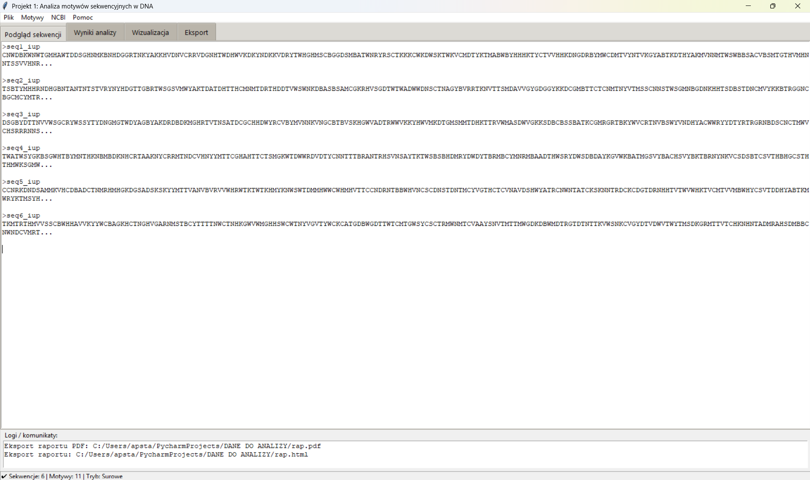

# DNA Motif Analyzer

Python-based bioinformatics application for DNA motif analysis in nucleotide sequences with IUPAC motif support, FASTA parsing, NCBI integration and data visualization.

---

## Project Overview

DNA Motif Analyzer is a desktop bioinformatics application developed in Python for identifying and analyzing nucleotide motifs in DNA sequences.

The application enables:

- loading and validation of FASTA sequence files  
- motif searching with full IUPAC nucleotide code support  
- quantitative analysis of motif occurrences  
- visualization of results using heatmaps and bar plots  
- export of results to CSV, HTML and PDF formats  
- retrieval of nucleotide sequences directly from the NCBI database using accession numbers or UIDs  

The project combines biological sequence analysis with modular software architecture and graphical data visualization.

---

## Features

- IUPAC nucleotide code support (e.g. N, R, Y)  
- overlapping motif matching  
- normalized motif occurrence analysis (per 1000 nt)  
- graphical user interface (Tkinter)  
- export of analytical results and visualizations  
- integration with NCBI sequence retrieval  
- matrix-based representation of motif analysis results  

---

## Technologies Used

- Python 3
- Tkinter
- NumPy
- Matplotlib
- Requests
- NCBI E-utilities API

---

## Project Structure

- `main.py` – application entry point  
- `gui_app.py` – graphical user interface  
- `analysis_engine.py` – motif analysis engine  
- `fasta_parser.py` – FASTA parsing and validation  
- `iupac.py` – IUPAC motif matching logic  
- `export_manager.py` – export functionality  
- `export_tab.py` – export GUI module  
- `ncbi_client.py` – communication with NCBI database  

---

## Requirements

- Python 3.10+

Required libraries:

```text
numpy
matplotlib
requests
```

---

## Installation

```bash
pip install -r requirements.txt
```

---

## Running the Application

```bash
python main.py
```

---

## Example Workflow

1. Load FASTA sequences or retrieve data from NCBI  
2. Define nucleotide motifs (e.g. ATG, TATAAA)  
3. Run motif analysis  
4. Review graphical and tabular results  
5. Export results and visualizations  

---

## Bioinformatics Scope

This project demonstrates:

- biological sequence analysis  
- motif searching algorithms  
- FASTA data processing  
- IUPAC ambiguity handling  
- bioinformatics software development  
- scientific data visualization  
- integration with biological databases  
- modular Python application architecture  

---

## Application Preview



---

## Author

**Alicja Stachura-Matyjewicz**
